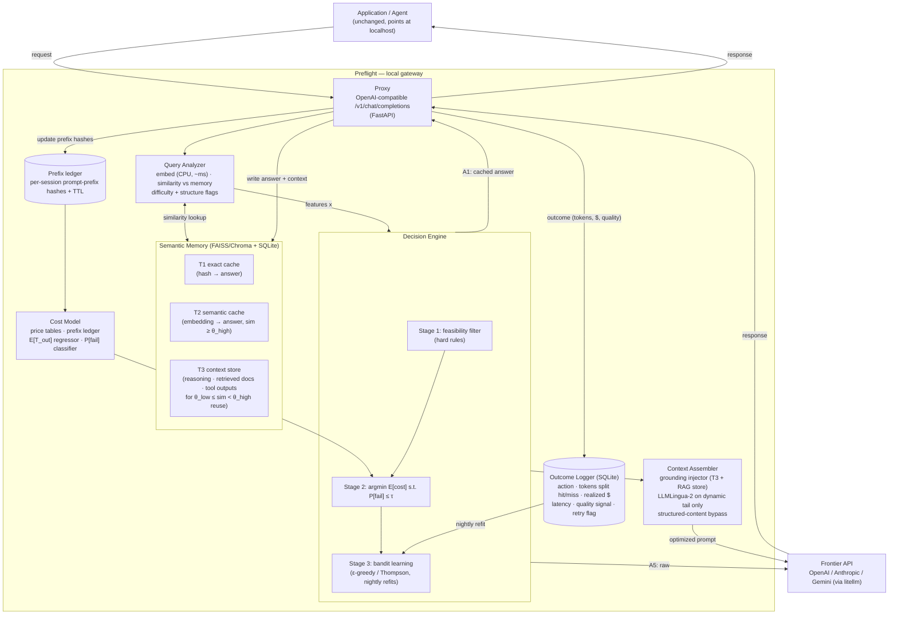
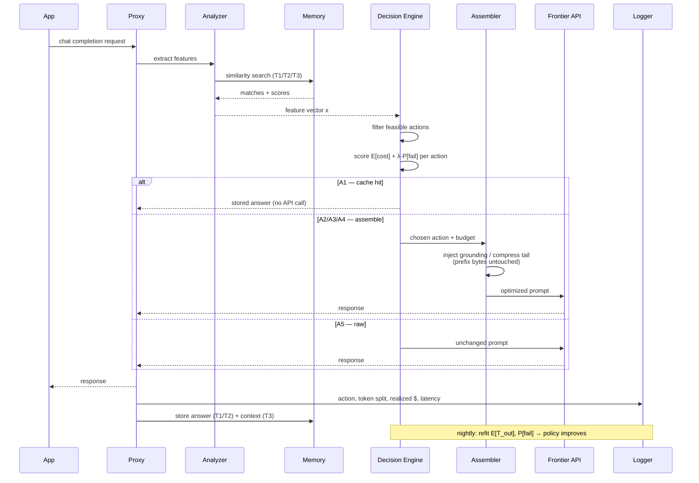

# Preflight — Design Document

A local gateway that sits between an application and a frontier LLM API and, for every request,
chooses the cheapest way to obtain an acceptable answer: reuse a past answer, reuse past context,
compress, inject grounding, or send raw.

- **Engineering artifact:** an OpenAI-compatible local proxy.
- **Research contribution:** the cost model + learned decision policy, and the Tier-3
  "context reuse" mechanism, evaluated in real dollars against fixed strategies.

---

## 1. The action space

For every incoming request the gateway picks exactly one action:

| ID | Action          | API call? | Description                                                                 |
|----|-----------------|-----------|-----------------------------------------------------------------------------|
| A1 | Serve-from-cache| No        | Return stored answer from exact/semantic cache                              |
| A2 | Context reuse   | Yes       | Inject compressed reasoning/grounding from a similar past request, then call |
| A3 | Compress        | Yes       | LLMLingua-2 on the dynamic tail of the prompt, prefix untouched              |
| A4 | Ground          | Yes       | Add retrieved grounding tokens from the local store, then call               |
| A5 | Raw passthrough | Yes       | Forward unchanged                                                            |

A2–A4 are composable in principle; v1 treats them as mutually exclusive to keep the
policy learnable, with (A2+A3 etc.) combinations as a later ablation.

---

## 2. Cost estimation

### 2.1 Principle: separate what is *known* from what must be *predicted*

The expected cost of an action splits into deterministic terms (computable locally, before the
call, with zero error) and stochastic terms (predicted by estimators trained on our own logs).

**Deterministic — computed, not estimated:**

| Quantity | How we get it |
|---|---|
| Input token count per candidate prompt | Local tokenizer (`tiktoken` / provider tokenizer). We literally build each candidate prompt (compressed, grounded, raw) and count. |
| Prices `p_in`, `p_out`, `p_cache_read`, `p_cache_write` | Static per-provider price table (refreshable via litellm's price map). |
| Which prefix bytes will hit the provider cache | **Prefix ledger** (see 2.2). We know what we sent previously, so cache hits are predictable, not random. |

**Stochastic — predicted by estimators trained on the Outcome Logger:**

| Quantity | Estimator | Cold-start default |
|---|---|---|
| Expected output tokens `E[T_out \| x, a]` | Regression on features `x` (see §3.2); start with per-task-type running means | Provider `max_tokens` × historical global mean ratio |
| Failure probability `P[fail \| x, a]` | Logistic regression; a "failure" = retry/rephrase detected, judge score below floor, or task reward = 0 | Conservative priors: `P[fail\|A5] = p₀` measured in warm-up; compression/grounding deltas from literature until we have data |
| False-hit probability for A1 `P[false \| sim]` | Calibrated curve of judge-agreement vs. similarity score, refit from sampled audits | Threshold θ_high set very conservatively (0.97+) |

### 2.2 The prefix ledger (predicting provider cache hits)

Provider-side prompt caching is deterministic given what we previously sent, so we track it:

- Per session/conversation, store a rolling hash chain of the prompt prefix sent in each call,
  with a timestamp.
- On a new request, the longest stored hash-chain prefix that (a) matches the candidate prompt
  byte-for-byte and (b) is younger than the provider's cache TTL is billed at the cached rate.
- Per-provider rules encoded as a small adapter: OpenAI (automatic, prefixes ≥ 1024 tokens),
  Anthropic (explicit `cache_control` breakpoints, read multiplier ~0.1×, write ~1.25×),
  Gemini (implicit + explicit context caching).

This is what makes the compression-vs-caching interaction decidable *in advance*: any candidate
prompt that mutates bytes inside a ledger-matched prefix forfeits the cached rate for everything
after the mutation point, and the cost model prices that in automatically.

### 2.3 The cost formula

For action `a` with feature vector `x`, candidate prompt token counts split by the ledger into
`T_hit` (billed cached) and `T_miss` (billed full):

```
E[cost(a, x)] =  p_in · T_miss(a)                    # uncached input
              +  p_cache_read · T_hit(a)             # cached input (ledger-predicted)
              +  p_cache_write · T_newprefix(a)      # Anthropic-style write premium, if any
              +  p_out · E[T_out | x, a]             # predicted output
              +  P[fail | x, a] · E[C_retry | x]     # expected failure follow-up cost
```

where `E[C_retry | x]` is the expected cost of the correction turn (measured from logs; a retry
resends the grown context, so it is strictly more expensive than the original call).

Special cases:

- **A1:** zero API terms, but `E[cost(A1)] = P[false | sim] · E[C_correction]` — a false hit
  costs a full correction exchange plus user trust. This term is what keeps θ_high honest.
- **A4 (grounding) is priced as an investment:** it adds `p_in · T_ground` but reduces
  `P[fail]`. The action wins exactly when
  `p_in · T_ground < (P[fail|A5] − P[fail|A4]) · E[C_retry]`.
  This inequality is the paper's "grounding as token investment" claim, made operational.
- **Local compute** (embedding, compression model): ≈ $0 in dollars, but its latency is logged
  and reported — reviewers of cost papers rightly check for hidden meta-costs.

### 2.4 Worked example

Query: 6k-token multi-turn coding session, provider = Anthropic-style pricing
(`p_in = $3/M`, `p_out = $15/M`, cache read 0.1×), ledger says 4k tokens of prefix are warm.

| Action | Input cost | Predicted output | Failure term | Total |
|---|---|---|---|---|
| A5 raw | 2k × $3 + 4k × $0.3 = $0.0072/1k… → **$0.0072** | 800 tok → $0.0120 | 0.08 × $0.045 = $0.0036 | **$0.0228** |
| A3 compress tail to 1k | 1k × $3 + 4k × $0.3 = **$0.0042** | 800 tok → $0.0120 | 0.11 × $0.045 = $0.0050 | **$0.0212** |
| A3 (naive, mutates prefix) | 5k × $3 = **$0.0150** | $0.0120 | $0.0050 | **$0.0320** ← worse than raw |

The same compressor is cheapest or most expensive depending entirely on cache state — this is
why a fixed strategy cannot win and a state-aware policy can.

---

## 3. Decision procedure

### 3.1 Three stages: filter → score → learn

**Stage 1 — Feasibility filter (hard rules, no learning).**
Eliminates actions that are invalid or provably pointless, shrinking the space the learner
must explore:

- A1 only if `sim ≥ θ_high` **and** conversation-context hash matches (MeanCache-style
  context chains — prevents cross-conversation false hits).
- A2 only if `θ_low ≤ sim < θ_high` and the matched entry has stored context (T3) that passes
  the freshness TTL.
- A3 only if the dynamic (non-ledger-matched) tail exceeds a minimum size (~1.5k tokens) —
  below that, compression overhead can't pay for itself. Structured blocks (JSON/code,
  detected by parser) are exempt from token pruning and get deterministic cleanup only.
- A4 only if the retrieval store returns chunks above a relevance floor.
- A5 always feasible (guaranteed fallback).

**Stage 2 — Constrained cost minimization.**
Among feasible actions, choose

```
a* = argmin_a  E[cost(a, x)]     subject to   P[fail | x, a] ≤ τ
```

implemented as the equivalent penalized score `E[cost(a,x)] + λ · P[fail | x, a]` so that a
single dial `λ` (dollars-per-expected-failure) sweeps the cost-quality frontier — this dial
produces the paper's headline Pareto curves.

**Stage 3 — Learning loop (what makes the policy improve).**
The formalism is a **contextual bandit**, not full RL: each request is one decision with an
immediately observable reward (realized dollars + quality signal), and no long-horizon state
transition. Concretely:

- The estimators `E[T_out | x, a]` and `P[fail | x, a]` are refit on a schedule (e.g. nightly)
  from the Outcome Logger.
- Exploration: ε-greedy (ε ≈ 0.05) or Thompson sampling over estimator uncertainty, so we keep
  collecting counterfactual data for actions the current policy disfavors. Exploration is
  disabled for A1 (never gamble on serving a possibly-wrong cached answer; audit A1 quality by
  *shadow-calling* the API on a small sample instead).
- Guardrail: if estimator uncertainty for the best action exceeds a bound, fall back to A5.
  The system must never be worse than a raw passthrough proxy.

### 3.2 The feature vector `x`

| Feature | Source | Feeds |
|---|---|---|
| Max similarity vs. memory, top-k gap | Query Analyzer | A1/A2 gating, `P[false]` |
| Conversation-context hash match | Memory | A1 gating |
| Total prompt tokens; ledger-warm prefix tokens; dynamic tail tokens | Tokenizer + prefix ledger | All cost terms |
| Structure flags (JSON/code fraction) | Parser | A3 routing |
| Difficulty proxy (math/code/multi-part heuristics, later a tiny classifier) | Query Analyzer | `E[T_out]`, `P[fail]` |
| Retrieval top-score from grounding store | Retriever | A4 gating |
| Task type tag (chat / RAG / agent-tool) | Caller header or classifier | Per-segment estimators |
| Provider + model requested | Request | Price table row |

### 3.3 Baselines the policy must beat

1. Raw passthrough (A5 always)
2. Cache-only (A1/A5 — GPTCache configuration)
3. Compress-always (A3/A5 — llm-zip configuration)
4. Cache-aware-compress (CAPC-style fixed strategy)
5. Preflight rule-based (Stages 1–2 with cold-start estimators)
6. Preflight learned (full Stage 3)

Claim structure: each of 1–4 is dominated in some region of
(query redundancy × context length × cache warmth); 6 ≈ per-region winner everywhere,
and 6 > 5 > best fixed on aggregate dollars at equal quality.

---

## 4. Architecture

### 4.1 Component diagram



### 4.2 Request lifecycle



---

## 5. Evaluation plan (summary)

- **Workloads:** tau-bench retail (verifiable task rewards, agentic, comparable to CAPC) and
  LongBench-v2 RAG, plus a synthetic query stream with controlled duplicate/near-duplicate
  rates to sweep the redundancy axis.
- **Metrics:** realized dollars per task (split by cache-hit class), quality delta vs. raw,
  A1 false-hit rate, middleware latency overhead, and full meta-cost accounting
  (embedding + compression compute reported, not hidden).
- **Providers:** headline table on two providers with different cache pricing to show the
  policy adapts.
- **Budget:** $100–200 total API spend (CAPC precedent: $98.96).

## 6. Build order

1. Proxy + T1/T2 cache + Outcome Logger (usable immediately; starts collecting data)
2. Prefix ledger + price tables (cost model becomes exact on the deterministic side)
3. Cache-aware compressor with structured-content bypass
4. T3 context store + A2 path
5. Rule-based policy (Stages 1–2) — first full end-to-end system, first benchmark run
6. Bandit layer (Stage 3) — trained on accumulated logs, final benchmark run
